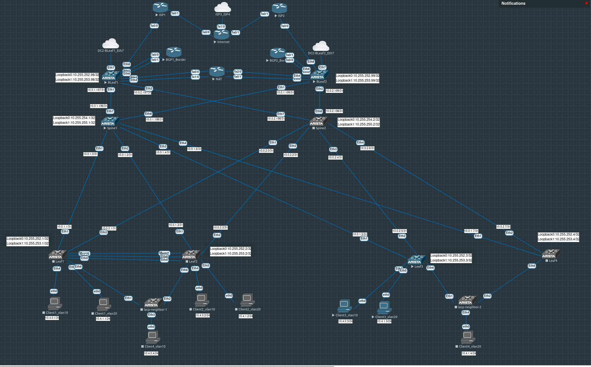
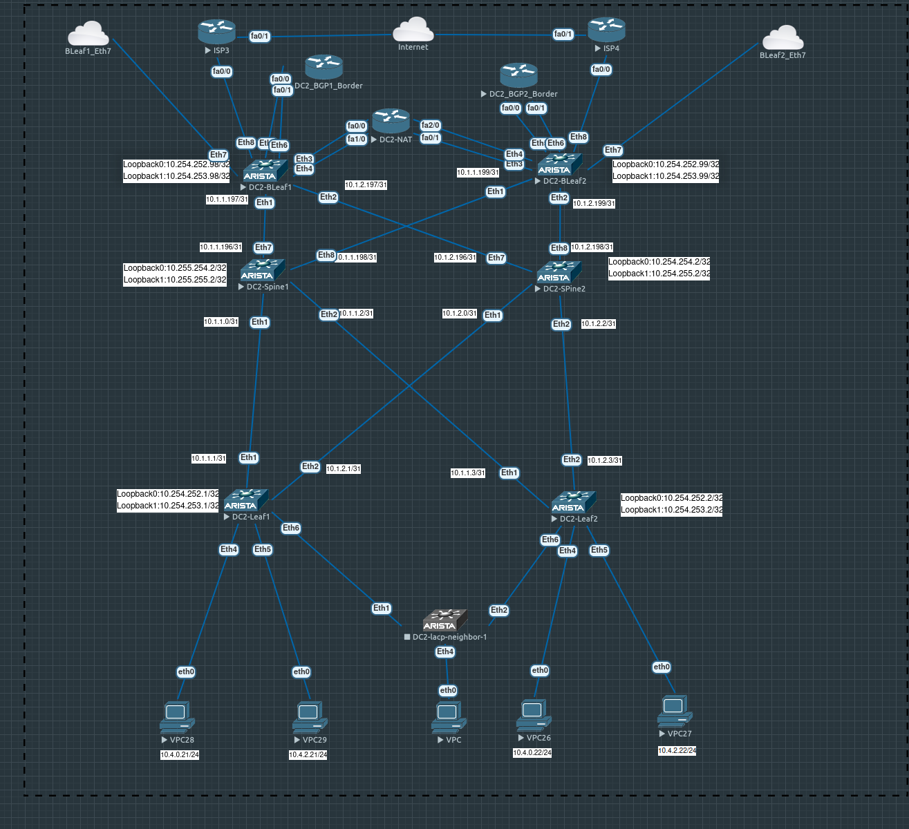

# Проектная работа "Связывание двух ЦОД с использованием технологии VXLAN Multisite"

### Цель:
- Реализовать построение двух ЦОД и связать их между собой с ипользованием технологии VXLAN Multisite на базе оборудования Arista;

### Топология
Дата-центр 1
  
Дата-центр 2


### Конфигурация

### Настройка EVPN-VXLAN в ЦОД1 и ЦОД2
ЦОД 1 настроен в лабораторных работах 1-8. По аналогии настроим ЦОД 2, адресация будет задана по аналогии  
underlay и overlay строится с использованием протокола маршрутизации BGP. На спайнах автономная система 65100, Лифы нумеруются с 65101 и далее. БордерЛифы с конца диапазона. Также настроим esi lag, в будущем это будет полезно показывая что маршруты типа 1 и 4 не распространяются между ЦОД`ами  
серверные сети в ЦОД1: 10.4.0.0/24, 10.4.1.0/24. Сети в ЦОД 10.4.0.0/24 (vlan 10 таже что и в ЦОД1, эту сеть будет растягивать между ЦОДами), 10.4.2.0/24

### Настройка Multisite
Для отказоустойчивости будет два линка между 1) BLeaf1 и DC2-BLeaf1 2) BLeaf2 и DC2-BLeaf2. Провайдер предоставляет темное волокно, поэтому смело можем включать mtu 9214 на интерфейсах. Рассмотрим на примере BLeaf1, на других настройки аналогичные. Стыковочные сети берем /31   
BLeaf1
```
interface Ethernet7
   description DC2-BLeaf1
   mtu 9214
   no switchport
   ip address 172.16.0.0/31

Leaf1#ping 172.16.0.1 source 172.16.0.0
PING 172.16.0.1 (172.16.0.1) from 172.16.0.0 : 72(100) bytes of data.
80 bytes from 172.16.0.1: icmp_seq=1 ttl=64 time=5.27 ms
80 bytes from 172.16.0.1: icmp_seq=2 ttl=64 time=3.12 ms
80 bytes from 172.16.0.1: icmp_seq=3 ttl=64 time=4.46 ms
80 bytes from 172.16.0.1: icmp_seq=4 ttl=64 time=2.69 ms
80 bytes from 172.16.0.1: icmp_seq=5 ttl=64 time=5.61 ms
```
   
Строим underlay bgp между BLeaf1 и DC2-BLeaf1 и анонсируем Loopback для построения overlay. Вешаем prefix-list чтобы между фабриками двух ЦОД не получать лупбеки всех лифов и спайнов, т.к. все-равно нужны только лупбеки БордерЛифов
```
ip prefix-list Border-loopback
   seq 10 permit 10.255.252.98/32
   seq 20 permit 10.255.253.98/32

router bgp 65098
   router-id 10.255.252.98
   neighbor underlay-dci peer group
   neighbor underlay-dci remote-as 65198
   neighbor underlay-dci bfd
   neighbor underlay-dci password 7 qBOkfTkALkc=
   neighbor 172.16.0.1 peer group underlay-dci
   address-family ipv4
      no neighbor evpn activate
      no neighbor evpn-dci activate
      neighbor underlay-dci prefix-list Border-loopback out
      network 10.255.252.98/32
      network 10.255.253.98/32

BLeaf1#sh ip bgp | i 65198
 * >      10.254.252.98/32       172.16.0.1            0       -          100     0       65198 i
 * >      10.254.253.98/32       172.16.0.1            0       -          100     0       65198 i
```

Теперь делаем BGP overlay на лупбеках. Ключевое слово domain remote дает понять, что пир является отдельным доменом
```
router bgp 65098
   neighbor evpn-dci peer group
   neighbor evpn-dci remote-as 65198
   neighbor evpn-dci next-hop-unchanged
   neighbor evpn-dci update-source Loopback0
   neighbor evpn-dci ebgp-multihop 3
   neighbor evpn-dci send-community extended  
   neighbor 10.254.252.98 peer group evpn-dci

address-family evpn
      neighbor evpn-dci activate
      neighbor evpn-dci domain remote

BLeaf1#sh bgp evpn su | i 65198
  10.254.252.98 4 65198          32074     32079    0    0 00:00:21 Estab   0     0

```
Далее растягиываем влан 10 между ЦОДами. К существующим командам rd добавляется rd evpn domain remote или можно заменить общей строкой rd evpn domain all. Тоже самое с import/export
```
   vlan 10
      rd evpn domain all 65098:100010
      route-target import export evpn domain all 1:100010
      redistribute learned

interface Vxlan1
   vxlan source-interface Loopback1
   vxlan udp-port 4789
   vxlan vlan 10 vni 100010
```
Проверяем L2 связность между ЦОДами. 10.4.0.3 подключен к Leaf3 в ЦОД1, а 10.4.0.21 подключен к DC2-Leaf1 в ЦОД1. Пинг есть. 
```
lient3_vl10> sh ip 

NAME        : Client3_vl10[1]
IP/MASK     : 10.4.0.3/24
GATEWAY     : 10.4.0.254
DNS         : 
MAC         : 00:50:79:66:68:08
LPORT       : 20000
RHOST:PORT  : 127.0.0.1:30000
MTU         : 1500

Client3_vl10> ping 10.4.0.21

84 bytes from 10.4.0.21 icmp_seq=1 ttl=64 time=431.914 ms
84 bytes from 10.4.0.21 icmp_seq=2 ttl=64 time=196.976 ms
84 bytes from 10.4.0.21 icmp_seq=3 ttl=64 time=88.632 ms
84 bytes from 10.4.0.21 icmp_seq=4 ttl=64 time=72.214 ms
84 bytes from 10.4.0.21 icmp_seq=5 ttl=64 time=169.343 ms

Client3_vl10> sh arp
00:50:79:66:68:1c  10.4.0.21 expires in 120 seconds

```
Проверяем, что правда строится vxlan туннель до бордера, а с бордера туннель до бордера в ЦОД2 и оттуда уже туннель до DC2-Leaf1, т.е. 3  туннеля а не одирн как в случае с multipod. Также на бордерах появляется запись remote при просмотре route-type 3 в таблице evpn.
```python
Leaf3#sh vxlan address-table vlan 10
          Vxlan Mac Address Table
----------------------------------------------------------------------

VLAN  Mac Address     Type      Prt  VTEP             Moves   Last Move
----  -----------     ----      ---  ----             -----   ---------
  10  0050.7966.681c  EVPN      Vx1  10.255.253.98    2       0:03:37 ago
Total Remote Mac Addresses for this criterion: 1

BLeaf1#sh vxlan address-table vlan 10
          Vxlan Mac Address Table
----------------------------------------------------------------------

VLAN  Mac Address     Type      Prt  VTEP             Moves   Last Move
----  -----------     ----      ---  ----             -----   ---------
  10  0050.7966.6808  EVPN      Vx1  10.255.253.3     1       0:05:45 ago //туннель на Leaf3 до 10.4.0.3
  10  0050.7966.681c  EVPN      Vx1  10.254.253.98    2       0:05:45 ago //туннель до DC2-BLeaf1 
Total Remote Mac Addresses for this criterion: 2

BLeaf1#sh bgp evpn route-type mac-ip 0050.7966.681c
BGP routing table information for VRF default
Router identifier 10.255.252.98, local AS number 65098
Route status codes: * - valid, > - active, S - Stale, E - ECMP head, e - ECMP
                    c - Contributing to ECMP, % - Pending BGP convergence
Origin codes: i - IGP, e - EGP, ? - incomplete
AS Path Attributes: Or-ID - Originator ID, C-LST - Cluster List, LL Nexthop - Link Local Nexthop

          Network                Next Hop              Metric  LocPref Weight  Path
 * >      RD: 65098:100010 mac-ip 0050.7966.681c
                                 -                     -       100     0       65198 65100 65101 i
 * >      RD: 65099:100010 mac-ip 0050.7966.681c
                                 10.255.253.99         -       100     0       65000 65099 65199 65100 65101 i
 * >      RD: 65098:100010 mac-ip 0050.7966.681c 10.4.0.21
                                 -                     -       100     0       65198 65100 65101 i
 * >      RD: 65099:100010 mac-ip 0050.7966.681c 10.4.0.21
                                 10.255.253.99         -       100     0       65000 65099 65199 65100 65101 i
 * >      RD: 65198:100010 mac-ip 0050.7966.681c remote
                                 10.254.253.98         -       100     0       65198 65100 65101 i
 * >      RD: 65198:100010 mac-ip 0050.7966.681c 10.4.0.21 remote
                                 10.254.253.98         -       100     0       65198 65100 65101 i

DC2-BLeaf1#sh vxlan address-table vlan 10
          Vxlan Mac Address Table
----------------------------------------------------------------------

VLAN  Mac Address     Type      Prt  VTEP             Moves   Last Move
----  -----------     ----      ---  ----             -----   ---------
  10  0050.7966.6808  EVPN      Vx1  10.255.253.98    346     0:00:16 ago
  10  0050.7966.681c  EVPN      Vx1  10.254.253.1     3       0:09:16 ago
Total Remote Mac Addresses for this criterion: 2
DC2-BLeaf1#C2-BLeaf1#sh vxlan address-table vlan 10

C2-Leaf1#sh vxlan address-table vlan 10
          Vxlan Mac Address Table
----------------------------------------------------------------------

VLAN  Mac Address     Type      Prt  VTEP             Moves   Last Move
----  -----------     ----      ---  ----             -----   ---------
  10  0050.7966.6808  EVPN      Vx1  10.254.253.98    210     0:01:07 ago
Total Remote Mac Addresses for this criterion: 1

```
Далее делаем связность по L3 между ЦОДами. После настроки будет обмен route-type 5 маршрутами. Включаем обмен между маршрутами между Бордерлифами
```
router bgp 65098
   address-family evpn
      neighbor default next-hop-self received-evpn-routes route-type ip-prefix inter-domain

interface Vxlan1
   vxlan vrf Customer1 vni 100666

```
