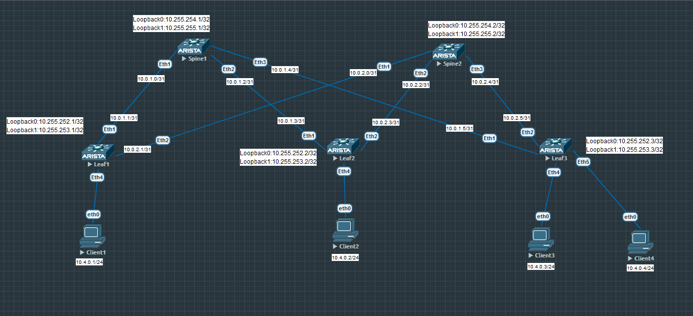

# Лабораторная работа по теме "Проектирование адресного пространства"

### Цель:
- Собрать схему CLOS;
- Распределить адресное пространство;

### Топология

### Конфигурация

Адреса Loopback интерфейсов

Loopback0: для Spine - 10.255.254.0/24, для Leaf - 10.255.252.0/24  
Loopback1: для Spine - 10.255.255.0/24, для Leaf - 10.255.253.0/24

Адреса p2p интерефейсов

10.0.x.y/31, где  
x - номер spine коммутатора  
y - порядковый номер (первый номер в сети для spine, второй номер в сети для leaf)

Адреса для сервисов
10.4.x.0/24, где  
х - сервис 

### Проверка

Spine1

Spine2

Client3
