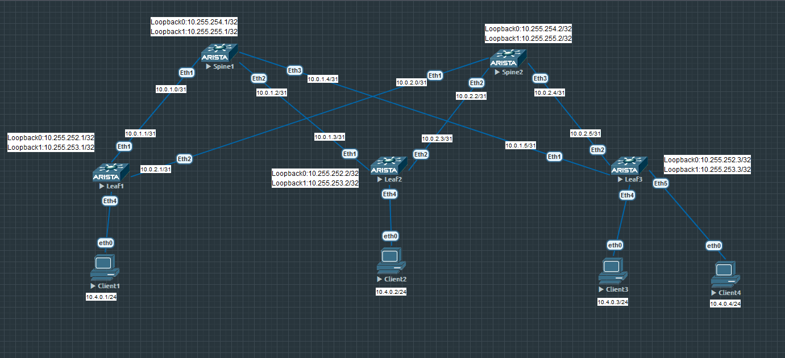
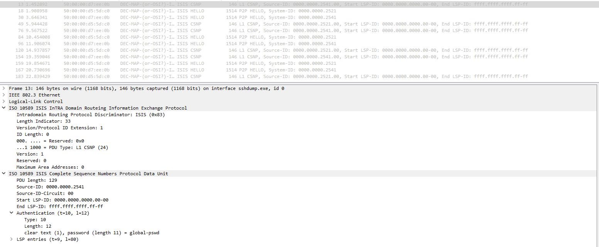
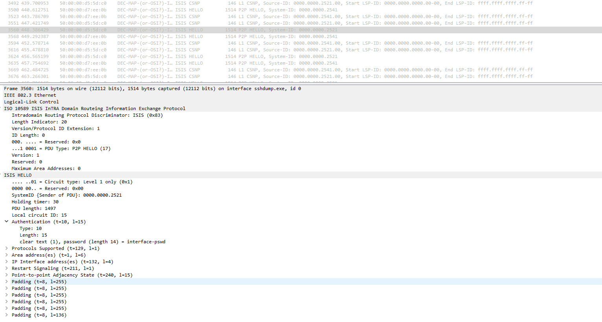

# Лабораторная работа по теме "Построение Underlay сети(ISIS)"

### Цель:
- Настроить ISIS для Underlay сети;

### Топология


### Конфигурация

Топология и адресация представлена выше на схеме.   
Настройка ISIS на Spine коммутаторах, меняется только net адрес в ISIS процессе. Для примера ниже конфигурация коммутатора Spine1. net адрес задаем так: пишем 49 - это обозначение локального сегмента, аля RFC 1918 для ip адресов. Дальше указываем номер area 0001, т.к. для лабораторной работы у нас все в 1 area будет. Затем идет system-id, последние значения его запишем по аналогии с Loopback0. Spine1 имеет Loopback0 адрес 10.255.254.1, тогда system-id будет 0000.0000.0000.2541. В итоге net получается 49.0001.0000.0000.0000.2541.00 для Spine1   
По умолчанию в ISIS type L1/L2, зададим для простоты руками L1. В ISIS аутентификация настраивается отдельно для LSP, CSNP, PSNP и Hello пакетов.  Включим аутентификацию для   LSP, CSNP и PSNP пакетов текстом для простоты сбора через wireshark. 
```
router isis underlay
   net 49.0001.0000.0000.0000.2541.00
   is-type level-1
   authentication mode text
   authentication key global-pswd
   address-family ipv4 unicast
```
   
Включаем ISIS на интерфейсах в сторону LEAF. Задаем аутентификацию для Hello пакетов для простоты сбора через wireshark.
```
interface Ethernet1
   description Leaf1
   no switchport
   ip address 10.0.1.0/31
   isis enable underlay
   isis bfd
   isis network point-to-point
   isis authentication mode text
   isis authentication key 0 interface-psw

interface Ethernet2
   description Leaf2
   no switchport
   ip address 10.0.1.2/31
   isis enable underlay
   isis bfd
   isis network point-to-point
   isis authentication mode text
   isis authentication key 0 interface-psw

interface Ethernet3
   description Leaf3
   no switchport
   ip address 10.0.1.4/31
   isis enable underlay
   isis bfd
   isis network point-to-point
   isis authentication mode text
   isis authentication key 0 interface-psw
```
   
Настройка ISIS на Leaf коммутаторах одинакова, меняется только net адрес. Для примера ниже конфигурация коммутатора Leaf1
```
router isis underlay
   net 49.0001.0000.0000.0000.2521.00
   is-type level-1
   authentication mode text
   authentication key global-pswd
   address-family ipv4 unicast
```
Также настраиваем интерфейсы смотрящие в стороны SPINE коммтутаторов.
```
interface Ethernet1
   description Leaf1
   no switchport
   ip address 10.0.1.0/31
   isis enable underlay
   isis bfd
   isis network point-to-point
   isis authentication mode text
   isis authentication key 0 interface-pswd

interface Ethernet2
   description Leaf2
   no switchport
   ip address 10.0.1.2/31
   isis enable underlay
   isis bfd
   isis network point-to-point
   isis authentication mode text
   isis authentication key 0 interface-pswd
```

### Проверка
ISIS соседство удобнее проверять со стороны Spine коммутаторов  
Spine1
```
Spine1#sh isis neighbors
Instance  VRF      System Id        Type Interface          SNPA              State Hold time   Circuit Id
underlay  default  Leaf1            L1   Ethernet1          P2P               UP    24          0F
underlay  default  Leaf2            L1   Ethernet2          P2P               UP    22          0F
underlay  default  Leaf3            L1   Ethernet3          P2P               UP    26          0F

Spine1#show bfd peers protocol isis
VRF name: default
-----------------
DstAddr       MyDisc    YourDisc  Interface/Transport    Type          LastUp  LastDown       LastDiag  State
--------- ----------- ----------- -------------------- ------- --------------- --------- -------------- -----
10.0.1.1  2269639566  2267063155        Ethernet1(15)  normal  11/21/24 04:30        NA  No Diagnostic     Up
10.0.1.3  1288286244  2344210618        Ethernet2(16)  normal  11/21/24 04:30        NA  No Diagnostic     Up
10.0.1.5  2085804511  2676713411        Ethernet3(17)  normal  11/21/24 04:31        NA  No Diagnostic     Up

```
Spine2
```
Spine2#sh  isis neighbors
Instance  VRF      System Id        Type Interface          SNPA              State Hold time   Circuit Id
underlay  default  Leaf1            L1   Ethernet1          P2P               UP    25          10
underlay  default  Leaf2            L1   Ethernet2          P2P               UP    21          10
underlay  default  Leaf3            L1   Ethernet3          P2P               UP    28          10

Spine2#sh bfd peers protocol isis
VRF name: default
-----------------
DstAddr       MyDisc    YourDisc  Interface/Transport    Type          LastUp  LastDown       LastDiag  State
--------- ----------- ----------- -------------------- ------- --------------- --------- -------------- -----
10.0.2.1  4249411532   891249246        Ethernet1(15)  normal  11/21/24 04:30        NA  No Diagnostic     Up
10.0.2.3  1804296625  3554137351        Ethernet2(16)  normal  11/21/24 04:30        NA  No Diagnostic     Up
10.0.2.5  3791290555  2299320696        Ethernet3(17)  normal  11/21/24 04:31        NA  No Diagnostic     Up

```
Проверку таблицу маршрутизации и IP доступности будем делать с Leaf1  


Leaf1
```
Leaf1#sh ip route isis

VRF: default
Codes: C - connected, S - static, K - kernel,
       O - OSPF, IA - OSPF inter area, E1 - OSPF external type 1,
       E2 - OSPF external type 2, N1 - OSPF NSSA external type 1,
       N2 - OSPF NSSA external type2, B - Other BGP Routes,
       B I - iBGP, B E - eBGP, R - RIP, I L1 - IS-IS level 1,
       I L2 - IS-IS level 2, O3 - OSPFv3, A B - BGP Aggregate,
       A O - OSPF Summary, NG - Nexthop Group Static Route,
       V - VXLAN Control Service, M - Martian,
       DH - DHCP client installed default route,
       DP - Dynamic Policy Route, L - VRF Leaked,
       G  - gRIBI, RC - Route Cache Route

 I L1     10.0.1.2/31 [115/20] via 10.0.1.0, Ethernet1
 I L1     10.0.1.4/31 [115/20] via 10.0.1.0, Ethernet1
 I L1     10.0.2.2/31 [115/20] via 10.0.2.0, Ethernet2
 I L1     10.0.2.4/31 [115/20] via 10.0.2.0, Ethernet2
 I L1     10.255.252.2/32 [115/30] via 10.0.1.0, Ethernet1
                                   via 10.0.2.0, Ethernet2
 I L1     10.255.252.3/32 [115/30] via 10.0.1.0, Ethernet1
                                   via 10.0.2.0, Ethernet2
 I L1     10.255.253.2/32 [115/30] via 10.0.1.0, Ethernet1
                                   via 10.0.2.0, Ethernet2
 I L1     10.255.253.3/32 [115/30] via 10.0.1.0, Ethernet1
                                   via 10.0.2.0, Ethernet2
 I L1     10.255.254.1/32 [115/20] via 10.0.1.0, Ethernet1
 I L1     10.255.254.2/32 [115/20] via 10.0.2.0, Ethernet2
 I L1     10.255.255.1/32 [115/20] via 10.0.1.0, Ethernet1
 I L1     10.255.255.2/32 [115/20] via 10.0.2.0, Ethernet2

Leaf1#sh bfd peer protocol isis
VRF name: default
-----------------
DstAddr       MyDisc    YourDisc  Interface/Transport    Type          LastUp  LastDown       LastDiag  State
--------- ----------- ----------- -------------------- ------- --------------- --------- -------------- -----
10.0.1.0  2267063155  2269639566        Ethernet1(15)  normal  11/21/24 04:30        NA  No Diagnostic     Up
10.0.2.0   891249246  4249411532        Ethernet2(16)  normal  11/21/24 04:30        NA  No Diagnostic     Up

```


