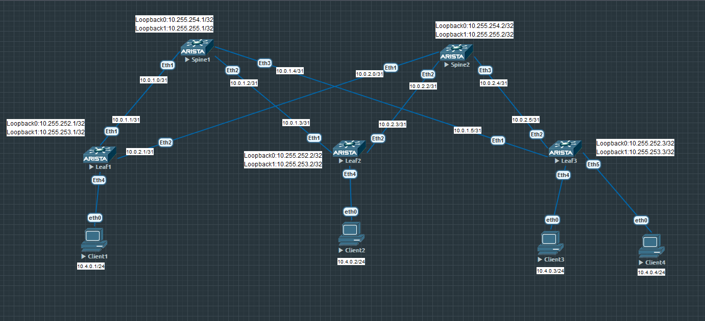

# Лабораторная работа по теме "Построение Overlay сети VXLAN-EVPN"

### Цель:
- Настроить VXLAN-EVPN для Overlay сети;

### Топология


### Конфигурация

Топология и адресация представлена выше на схеме.   
Underlay для топологии представлен eBGP (см.  ) Только в конфиге добавим настройку динамических BGP соседей.  
Spine1
```
router bgp 65000
   router-id 10.255.254.1
   maximum-paths 4
   bgp listen range 10.0.1.0/24 peer-group underlay peer-filter AS-numbers
   neighbor underlay peer group
   neighbor underlay bfd
   neighbor underlay password 7 DYTHXlpndyU=
   neighbor underlay send-community
   network 10.255.254.1/32
   network 10.255.255.1/32

peer-filter AS-numbers
   10 match as-range 65001-65099 result accept
```

На каждом коммутаторе включаем поддержку evpn вводя команду - service routing protocols model multi-agent  
Далее настраиваем bgp evpn. Т.к. соседство по лупбекам то делаем ebgp-multihop 3. В address-family ipv4 отключаем соседство лупбеков, т.к. иначе у меня строятся соседи в глобальной таблице (или это нормальное поведение или у меня OS такая, но пока не делал через bgp listen range этого делать не надо было). Обязательно включаем community exteneded  
Spine 1
```
router bgp 65000
   router-id 10.255.254.1
   maximum-paths 4
   bgp listen range 10.255.252.0/24 peer-group evpn peer-filter AS-numbers
   bgp listen range 10.0.1.0/24 peer-group underlay peer-filter AS-numbers
   neighbor evpn peer group
   neighbor evpn next-hop-unchanged
   neighbor evpn update-source Loopback0
   neighbor evpn ebgp-multihop 3
   neighbor evpn send-community extended
   neighbor underlay peer group
   neighbor underlay bfd
   neighbor underlay password 7 DYTHXlpndyU=
   neighbor underlay send-community
   !
   address-family evpn
      neighbor evpn activate
   !
   address-family ipv4
      no neighbor evpn activate
      network 10.255.254.1/32
      network 10.255.255.1/32
```
Leaf1
```
router bgp 65001
   router-id 10.255.252.1
   maximum-paths 4
   neighbor evpn peer group
   neighbor evpn remote-as 65000
   neighbor evpn update-source Loopback0
   neighbor evpn ebgp-multihop 3
   neighbor evpn send-community extended
   neighbor underlay peer group
   neighbor underlay remote-as 65000
   neighbor underlay bfd
   neighbor underlay password 7 DYTHXlpndyU=
   neighbor underlay send-community
   neighbor 10.0.1.0 peer group underlay
   neighbor 10.0.2.0 peer group underlay
   neighbor 10.255.254.1 peer group evpn
   neighbor 10.255.254.2 peer group evpn
   !
   address-family evpn
      neighbor evpn activate
   !
   address-family ipv4
      no neighbor evpn activate
      network 10.255.252.1/32
      network 10.255.253.1/32
```

### Проверка bgp evpn 
Пока префиксы по нулям, т.к. vxlan туннели еще не созданы и не подняты
Spine1
```
Spine1#sh bgp evpn su
BGP summary information for VRF default
Router identifier 10.255.254.1, local AS number 65000
Neighbor Status Codes: m - Under maintenance
  Neighbor     V AS           MsgRcvd   MsgSent  InQ OutQ  Up/Down State   PfxRcd PfxAcc
  10.255.252.1 4 65001             71        72    0    0 00:52:59 Estab   0      0
  10.255.252.2 4 65002             68        67    0    0 00:50:46 Estab   0      0
  10.255.252.3 4 65003             69        67    0    0 00:50:50 Estab   0      0
```
Leaf1
```
Leaf1#sh bgp ev su
BGP summary information for VRF default
Router identifier 10.255.252.1, local AS number 65001
Neighbor Status Codes: m - Under maintenance
  Neighbor     V AS           MsgRcvd   MsgSent  InQ OutQ  Up/Down State   PfxRcd PfxAcc
  10.255.254.1 4 65000             24        25    0    0 00:00:30 Estab   0      0
  10.255.254.2 4 65000             26        27    0    0 00:00:30 Estab   0      0

```
### Настройка VXLAN
На всех Leaf коммутаторах настраиваем VTEP интерфейсы. Берем тестовый vlan 10, который будем растягивать, задаем ему VNI в VXLAN 10010. Делаем redistribute все  выученных маков в overlay evpn-bgp. route-target зададим руками, в след. лабе l3-vni попробую auto с помощью retain-target на spine. Конфигурации Leaf коммутатов одинаковые, меняются только route distinguisher.
Leaf1
```
vlan 10
   name test-l2
!
interface Vxlan1
   vxlan source-interface Loopback1
   vxlan udp-port 4789
   vxlan vlan 10 vni 100010
   vxlan learn-restrict any
!
router bgp 65001
   !
   vlan 10
      rd 65001:100010
      route-target both 1:100010
      redistribute learned
```
### Проверка VXLAN
Видим что интерфейс Vxlan1 поднялся и он видит два vtep (Leaf2, Leaf3)
```
Leaf1#sh int vxlan 1
Vxlan1 is up, line protocol is up (connected)
  Hardware is Vxlan
  Source interface is Loopback1 and is active with 10.255.253.1
  Listening on UDP port 4789
  Replication/Flood Mode is headend with Flood List Source: EVPN
  Remote MAC learning via EVPN
  VNI mapping to VLANs
  Static VLAN to VNI mapping is
    [10, 100010]
  Note: All Dynamic VLANs used by VCS are internal VLANs.
        Use 'show vxlan vni' for details.
  Static VRF to VNI mapping is not configured
  Headend replication flood vtep list is:
    10 10.255.253.2    10.255.253.3
  Shared Router MAC is 0000.0000.0000
```
Теперь от bgp соседей (Spine1 и Spine2) видим по 2 префикса. Это наши туннели - route-type 3 маршруты
```
Leaf1#sh bgp evpn summary
BGP summary information for VRF default
Router identifier 10.255.252.1, local AS number 65001
Neighbor Status Codes: m - Under maintenance
  Neighbor     V AS           MsgRcvd   MsgSent  InQ OutQ  Up/Down State   PfxRcd PfxAcc
  10.255.254.1 4 65000            116       115    0    0 01:13:27 Estab   2      2
  10.255.254.2 4 65000            117       115    0    0 01:13:28 Estab   2      2

Leaf1#sh bgp evpn
BGP routing table information for VRF default
Router identifier 10.255.252.1, local AS number 65001
Route status codes: * - valid, > - active, S - Stale, E - ECMP head, e - ECMP
                    c - Contributing to ECMP, % - Pending BGP convergence
Origin codes: i - IGP, e - EGP, ? - incomplete
AS Path Attributes: Or-ID - Originator ID, C-LST - Cluster List, LL Nexthop - Link Local Nexthop

          Network                Next Hop              Metric  LocPref Weight  Path
 * >      RD: 65001:100010 imet 10.255.253.1
                                 -                     -       -       0       i
 * >Ec    RD: 65002:100010 imet 10.255.253.2
                                 10.255.253.2          -       100     0       65000 65002 i
 *  ec    RD: 65002:100010 imet 10.255.253.2
                                 10.255.253.2          -       100     0       65000 65002 i
 * >Ec    RD: 65003:100010 imet 10.255.253.3
                                 10.255.253.3          -       100     0       65000 65003 i
 *  ec    RD: 65003:100010 imet 10.255.253.3
                                 10.255.253.3          -       100     0       65000 65003 i
```
###Настройка интерфейсов пользователей и проверка связности
Настроим все интерфейсы пользователей в 10 влане (Сlinet1, Clinet2, Clinet3, Client4)
```
Leaf1#sh run int e 4
interface Ethernet4
   switchport access vlan 10
   spanning-tree portfast
   spanning-tree bpduguard enable
```

```
Client1> ping 10.4.0.2
84 bytes from 10.4.0.2 icmp_seq=1 ttl=64 time=15.733 ms
84 bytes from 10.4.0.2 icmp_seq=2 ttl=64 time=15.065 ms
84 bytes from 10.4.0.2 icmp_seq=3 ttl=64 time=21.395 ms
84 bytes from 10.4.0.2 icmp_seq=4 ttl=64 time=16.859 ms
84 bytes from 10.4.0.2 icmp_seq=5 ttl=64 time=14.147 ms

Client1> ping 10.4.0.3
84 bytes from 10.4.0.3 icmp_seq=1 ttl=64 time=22.722 ms
84 bytes from 10.4.0.3 icmp_seq=2 ttl=64 time=17.635 ms
84 bytes from 10.4.0.3 icmp_seq=3 ttl=64 time=15.151 ms
84 bytes from 10.4.0.3 icmp_seq=4 ttl=64 time=15.517 ms
84 bytes from 10.4.0.3 icmp_seq=5 ttl=64 time=53.612 ms

Client1> ping 10.4.0.4
84 bytes from 10.4.0.4 icmp_seq=1 ttl=64 time=17.076 ms
84 bytes from 10.4.0.4 icmp_seq=2 ttl=64 time=15.694 ms
84 bytes from 10.4.0.4 icmp_seq=3 ttl=64 time=15.949 ms
84 bytes from 10.4.0.4 icmp_seq=4 ttl=64 time=38.109 ms
84 bytes from 10.4.0.4 icmp_seq=5 ttl=64 time=16.731 ms

Client1> arp
00:50:79:66:68:07  10.4.0.2 expires in 100 seconds
00:50:79:66:68:08  10.4.0.3 expires in 107 seconds
00:50:79:66:68:09  10.4.0.4 expires in 113 seconds
```
В таблице bgp evpn это должны быть маки, route-type 2. Отфильтруем вывод по этому типу
```
Leaf1#sh bgp evpn route-type mac-ip
BGP routing table information for VRF default
Router identifier 10.255.252.1, local AS number 65001
Route status codes: * - valid, > - active, S - Stale, E - ECMP head, e - ECMP
                    c - Contributing to ECMP, % - Pending BGP convergence
Origin codes: i - IGP, e - EGP, ? - incomplete
AS Path Attributes: Or-ID - Originator ID, C-LST - Cluster List, LL Nexthop - Link Local Nexthop

          Network                Next Hop              Metric  LocPref Weight  Path
 * >      RD: 65001:100010 mac-ip 0050.7966.6806
                                 -                     -       -       0       i
 * >Ec    RD: 65002:100010 mac-ip 0050.7966.6807
                                 10.255.253.2          -       100     0       65000 65002 i
 *  ec    RD: 65002:100010 mac-ip 0050.7966.6807
                                 10.255.253.2          -       100     0       65000 65002 i
 * >Ec    RD: 65003:100010 mac-ip 0050.7966.6808
                                 10.255.253.3          -       100     0       65000 65003 i
 *  ec    RD: 65003:100010 mac-ip 0050.7966.6808
                                 10.255.253.3          -       100     0       65000 65003 i
 * >Ec    RD: 65003:100010 mac-ip 0050.7966.6809
                                 10.255.253.3          -       100     0       65000 65003 i
 *  ec    RD: 65003:100010 mac-ip 0050.7966.6809
                                 10.255.253.3          -       100     0       65000 65003 i
```
И смотрим таблицу мак адресов на Leaf1, из которой видно 4 мака в 10 влане. Один интернал и три прилетели через vtep интерфейс vxlan1
```
Leaf1#sh mac address-table vlan 10
          Mac Address Table
------------------------------------------------------------------

Vlan    Mac Address       Type        Ports      Moves   Last Move
----    -----------       ----        -----      -----   ---------
  10    0050.7966.6806    DYNAMIC     Et4        1       0:11:41 ago
  10    0050.7966.6807    DYNAMIC     Vx1        1       0:10:40 ago
  10    0050.7966.6808    DYNAMIC     Vx1        1       0:10:46 ago
  10    0050.7966.6809    DYNAMIC     Vx1        1       0:09:01 ago
Total Mac Addresses for this criterion: 4
```
