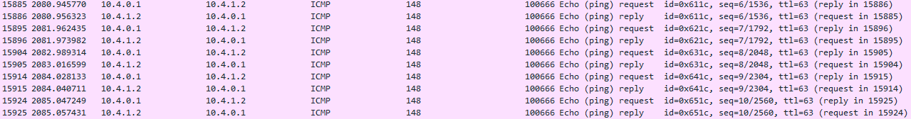

# Лабораторная работа по теме "Построение Overlay сети VXLAN-EVPN для L3"

### Цель:
- Настроить VXLAN-EVPN L3 для Overlay сети ;

### Топология


### Конфигурация

Топология и адресация представлена выше на схеме. Добавим несколько пользовательских хостов чтобы удобнее было настраивать   
Underlay для топологии представлен eBGP (см.  ) Настройка VXLAN-EVPN для L2 представлениа в (см.  )  
Настроим еще один vlan 20 по аналогии с vlan 10 из предыдущей лабораторной работы. Делаем конфиг на все Leaf.  
Leaf 1
```
vlan 20
   name second-test-l2
!
router bgp 65001
   vlan 20
      rd 65001:100020
      route-target both 1:100020
      redistribute learned
!
interface Vxlan1
   vxlan vlan 20 vni 100020
! 
```

### Проверка L2 connectivity в 10 и 20 вланах
Cleint1 vlan 10
```
Client1_vl10> ping 10.4.0.2

84 bytes from 10.4.0.2 icmp_seq=1 ttl=64 time=84.736 ms
84 bytes from 10.4.0.2 icmp_seq=2 ttl=64 time=19.903 ms
84 bytes from 10.4.0.2 icmp_seq=3 ttl=64 time=16.654 ms
84 bytes from 10.4.0.2 icmp_seq=4 ttl=64 time=15.899 ms
84 bytes from 10.4.0.2 icmp_seq=5 ttl=64 time=14.192 ms

Client1_vl10> ping 10.4.0.3

84 bytes from 10.4.0.3 icmp_seq=1 ttl=64 time=35.149 ms
84 bytes from 10.4.0.3 icmp_seq=2 ttl=64 time=17.945 ms
84 bytes from 10.4.0.3 icmp_seq=3 ttl=64 time=16.972 ms
84 bytes from 10.4.0.3 icmp_seq=4 ttl=64 time=14.811 ms
84 bytes from 10.4.0.3 icmp_seq=5 ttl=64 time=18.923 ms

Client1_vl10>
Client1_vl10> sh arp

00:50:79:66:68:07  10.4.0.2 expires in 106 seconds
00:50:79:66:68:08  10.4.0.3 expires in 112 seconds
```
Client1 vlan 20
```
Client1_vl20> ping 10.4.1.2

84 bytes from 10.4.1.2 icmp_seq=1 ttl=64 time=14.586 ms
84 bytes from 10.4.1.2 icmp_seq=2 ttl=64 time=15.284 ms
84 bytes from 10.4.1.2 icmp_seq=3 ttl=64 time=15.621 ms
84 bytes from 10.4.1.2 icmp_seq=4 ttl=64 time=15.922 ms
84 bytes from 10.4.1.2 icmp_seq=5 ttl=64 time=15.038 ms

Client1_vl20> ping 10.4.1.3

84 bytes from 10.4.1.3 icmp_seq=1 ttl=64 time=25.540 ms
84 bytes from 10.4.1.3 icmp_seq=2 ttl=64 time=16.624 ms
84 bytes from 10.4.1.3 icmp_seq=3 ttl=64 time=13.628 ms
84 bytes from 10.4.1.3 icmp_seq=4 ttl=64 time=14.416 ms
84 bytes from 10.4.1.3 icmp_seq=5 ttl=64 time=15.872 ms

Client1_vl20> sh arp

00:50:79:66:68:11  10.4.1.2 expires in 94 seconds
00:50:79:66:68:09  10.4.1.3 expires in 113 seconds
```
### Настройка Anycast GW
На всех Leaf настраиваем anycast gateway. Делаем виртуальный мак, который будет одинаковый для всех Leaf`ов. Создаем vrf Customer1 куда помещаем interface vlan10 и interface vlan 20 (шлюзы для вланов 10 и 20)
Leaf1
```
ip virtual-router mac-address 00:01:00:02:00:03
!
vrf instance Customer1
ip routing vrf Customer1
!
interface Vlan10
   vrf Customer1
   ip address virtual 10.4.0.254/24
!
interface Vlan20
   vrf Customer1
   ip address virtual 10.4.1.254/24
```
### Проверка работы anycast GW  
Clinet1 vlan 10
```
Client1_vl10> ping 10.4.0.254

84 bytes from 10.4.0.254 icmp_seq=1 ttl=64 time=51.371 ms
84 bytes from 10.4.0.254 icmp_seq=2 ttl=64 time=3.842 ms
84 bytes from 10.4.0.254 icmp_seq=3 ttl=64 time=3.831 ms
84 bytes from 10.4.0.254 icmp_seq=4 ttl=64 time=4.909 ms
84 bytes from 10.4.0.254 icmp_seq=5 ttl=64 time=3.009 ms

Client1_vl10> sh arp

00:01:00:02:00:03  10.4.0.254 expires in 113 seconds
```
Client1 vlan 20
```
Client1_vl20> ping 10.4.1.254

84 bytes from 10.4.1.254 icmp_seq=1 ttl=64 time=8.595 ms
84 bytes from 10.4.1.254 icmp_seq=2 ttl=64 time=3.803 ms
84 bytes from 10.4.1.254 icmp_seq=3 ttl=64 time=3.243 ms
84 bytes from 10.4.1.254 icmp_seq=4 ttl=64 time=3.046 ms
84 bytes from 10.4.1.254 icmp_seq=5 ttl=64 time=4.988 ms

Client1_vl20> sh arp

00:01:00:02:00:03  10.4.1.254 expires in 114 seconds
```
### Настройка VXLAN-EVPN для L3  
Подобно нашему mac-vrf мы также для L3 анонсируем наш созданный ip-vrf Customer1. Также делаем для всех всех Leaf где находится данный vrf. И добавляем в Vxlan туннель. 
Leaf1
```
кouter bgp 65001
   vrf Customer1
      rd 10.255.252.1:1
      route-target import evpn 1:100666
      route-target export evpn 1:100666
      redistribute connected
!
interface Vxlan1
   vxlan vrf Customer1 vni 100666
```
###Проверка VXLAN-EVPN для L3
Проверим с клиента с 10 влана что он видит всех клиентов в 20 влане  
Client1 vlan 10
```
Client1_vl10> ping 10.4.0.254

84 bytes from 10.4.0.254 icmp_seq=1 ttl=64 time=51.371 ms
84 bytes from 10.4.0.254 icmp_seq=2 ttl=64 time=3.842 ms
84 bytes from 10.4.0.254 icmp_seq=3 ttl=64 time=3.831 ms
84 bytes from 10.4.0.254 icmp_seq=4 ttl=64 time=4.909 ms
84 bytes from 10.4.0.254 icmp_seq=5 ttl=64 time=3.009 ms

Client1_vl10> sh arp

00:01:00:02:00:03  10.4.0.254 expires in 113 seconds

Client1_vl10>
Client1_vl10> ping 10.4.1.1

84 bytes from 10.4.1.1 icmp_seq=1 ttl=63 time=44.841 ms
84 bytes from 10.4.1.1 icmp_seq=2 ttl=63 time=11.876 ms
84 bytes from 10.4.1.1 icmp_seq=3 ttl=63 time=6.151 ms
84 bytes from 10.4.1.1 icmp_seq=4 ttl=63 time=7.444 ms
84 bytes from 10.4.1.1 icmp_seq=5 ttl=63 time=5.877 ms

Client1_vl10> ping 10.4.1.2

84 bytes from 10.4.1.2 icmp_seq=1 ttl=62 time=416.485 ms
84 bytes from 10.4.1.2 icmp_seq=2 ttl=62 time=18.645 ms
84 bytes from 10.4.1.2 icmp_seq=3 ttl=62 time=17.733 ms
84 bytes from 10.4.1.2 icmp_seq=4 ttl=62 time=21.969 ms
84 bytes from 10.4.1.2 icmp_seq=5 ttl=62 time=16.910 ms

Client1_vl10> ping 10.4.1.3

84 bytes from 10.4.1.3 icmp_seq=1 ttl=62 time=333.860 ms
84 bytes from 10.4.1.3 icmp_seq=2 ttl=62 time=17.116 ms
84 bytes from 10.4.1.3 icmp_seq=3 ttl=62 time=15.435 ms
84 bytes from 10.4.1.3 icmp_seq=4 ttl=62 time=16.703 ms
84 bytes from 10.4.1.3 icmp_seq=5 ttl=62 time=54.828 ms

Client1_vl10> trace 10.4.1.1
trace to 10.4.1.1, 8 hops max, press Ctrl+C to stop
 1   10.4.0.254   3.456 ms  2.666 ms  7.628 ms
 2   *10.4.1.1   7.251 ms (ICMP type:3, code:3, Destination port unreachable)
```
У нас получилась симметричная модель Integrated Routing and Bridging. Это видно даже из wireshark dump пакетов

