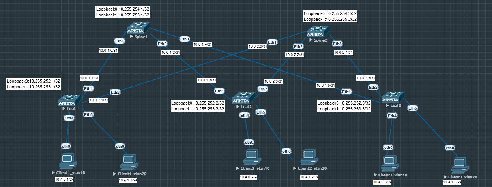

# Лабораторная работа по теме "Построение Overlay сети VXLAN-EVPN для L3"

### Цель:
- Настроить VXLAN-EVPN L3 для Overlay сети ;

### Топология


### Конфигурация

Топология и адресация представлена выше на схеме. Добавим несколько пользовательских хостов чтобы удобнее было настраивать   
Underlay для топологии представлен eBGP (см.  ) Настройка VXLAN-EVPN для L2 представлениа в (см.  )  
Настроим еще один vlan 20 по аналогии с vlan 10 из предыдущей лабораторной работы. Делаем конфиг на все Leaf.  
Leaf 1
```
vlan 20
   name second-test-l2
!
router bgp 65001
   vlan 20
      rd 65001:100020
      route-target both 1:100020
      redistribute learned
!
interface Vxlan1
   vxlan vlan 20 vni 100020
! 
```

### Проверка L2 connectivity в 10 и 20 вланах
Cleint1 vlan 10
```
Client1_vl10> ping 10.4.0.2

84 bytes from 10.4.0.2 icmp_seq=1 ttl=64 time=84.736 ms
84 bytes from 10.4.0.2 icmp_seq=2 ttl=64 time=19.903 ms
84 bytes from 10.4.0.2 icmp_seq=3 ttl=64 time=16.654 ms
84 bytes from 10.4.0.2 icmp_seq=4 ttl=64 time=15.899 ms
84 bytes from 10.4.0.2 icmp_seq=5 ttl=64 time=14.192 ms

Client1_vl10> ping 10.4.0.3

84 bytes from 10.4.0.3 icmp_seq=1 ttl=64 time=35.149 ms
84 bytes from 10.4.0.3 icmp_seq=2 ttl=64 time=17.945 ms
84 bytes from 10.4.0.3 icmp_seq=3 ttl=64 time=16.972 ms
84 bytes from 10.4.0.3 icmp_seq=4 ttl=64 time=14.811 ms
84 bytes from 10.4.0.3 icmp_seq=5 ttl=64 time=18.923 ms

Client1_vl10>
Client1_vl10> sh arp

00:50:79:66:68:07  10.4.0.2 expires in 106 seconds
00:50:79:66:68:08  10.4.0.3 expires in 112 seconds
```
Client1 vlan 20
```
Client1_vl20> ping 10.4.1.2

84 bytes from 10.4.1.2 icmp_seq=1 ttl=64 time=14.586 ms
84 bytes from 10.4.1.2 icmp_seq=2 ttl=64 time=15.284 ms
84 bytes from 10.4.1.2 icmp_seq=3 ttl=64 time=15.621 ms
84 bytes from 10.4.1.2 icmp_seq=4 ttl=64 time=15.922 ms
84 bytes from 10.4.1.2 icmp_seq=5 ttl=64 time=15.038 ms

Client1_vl20> ping 10.4.1.3

84 bytes from 10.4.1.3 icmp_seq=1 ttl=64 time=25.540 ms
84 bytes from 10.4.1.3 icmp_seq=2 ttl=64 time=16.624 ms
84 bytes from 10.4.1.3 icmp_seq=3 ttl=64 time=13.628 ms
84 bytes from 10.4.1.3 icmp_seq=4 ttl=64 time=14.416 ms
84 bytes from 10.4.1.3 icmp_seq=5 ttl=64 time=15.872 ms

Client1_vl20> sh arp

00:50:79:66:68:11  10.4.1.2 expires in 94 seconds
00:50:79:66:68:09  10.4.1.3 expires in 113 seconds
```
### Настройка VXLAN-EVPN L3
На всех Leaf настраиваем anycast gateway. Делаем виртуальный мак, который будет одинаковый для всех Leaf`ов. Создаем vrf Customer1 куда помещаем interface vlan10 и interface vlan 20 (шлюзы для вланов 10 и 20)
Leaf1
```
ip virtual-router mac-address 00:01:00:02:00:03
!
vrf instance Customer1
ip routing vrf Customer1
!
interface Vlan10
   vrf Customer1
   ip address virtual 10.4.0.254/24
!
interface Vlan20
   vrf Customer1
   ip address virtual 10.4.1.254/24
```
### Проверка VXLAN
Видим что интерфейс Vxlan1 поднялся и он видит два vtep (Leaf2, Leaf3)
```
Leaf1#sh int vxlan 1
Vxlan1 is up, line protocol is up (connected)
  Hardware is Vxlan
  Source interface is Loopback1 and is active with 10.255.253.1
  Listening on UDP port 4789
  Replication/Flood Mode is headend with Flood List Source: EVPN
  Remote MAC learning via EVPN
  VNI mapping to VLANs
  Static VLAN to VNI mapping is
    [10, 100010]
  Note: All Dynamic VLANs used by VCS are internal VLANs.
        Use 'show vxlan vni' for details.
  Static VRF to VNI mapping is not configured
  Headend replication flood vtep list is:
    10 10.255.253.2    10.255.253.3
  Shared Router MAC is 0000.0000.0000
```
Теперь от bgp соседей (Spine1 и Spine2) видим по 2 префикса. Это наши туннели - route-type 3 маршруты
```
Leaf1#sh bgp evpn summary
BGP summary information for VRF default
Router identifier 10.255.252.1, local AS number 65001
Neighbor Status Codes: m - Under maintenance
  Neighbor     V AS           MsgRcvd   MsgSent  InQ OutQ  Up/Down State   PfxRcd PfxAcc
  10.255.254.1 4 65000            116       115    0    0 01:13:27 Estab   2      2
  10.255.254.2 4 65000            117       115    0    0 01:13:28 Estab   2      2

Leaf1#sh bgp evpn
BGP routing table information for VRF default
Router identifier 10.255.252.1, local AS number 65001
Route status codes: * - valid, > - active, S - Stale, E - ECMP head, e - ECMP
                    c - Contributing to ECMP, % - Pending BGP convergence
Origin codes: i - IGP, e - EGP, ? - incomplete
AS Path Attributes: Or-ID - Originator ID, C-LST - Cluster List, LL Nexthop - Link Local Nexthop

          Network                Next Hop              Metric  LocPref Weight  Path
 * >      RD: 65001:100010 imet 10.255.253.1
                                 -                     -       -       0       i
 * >Ec    RD: 65002:100010 imet 10.255.253.2
                                 10.255.253.2          -       100     0       65000 65002 i
 *  ec    RD: 65002:100010 imet 10.255.253.2
                                 10.255.253.2          -       100     0       65000 65002 i
 * >Ec    RD: 65003:100010 imet 10.255.253.3
                                 10.255.253.3          -       100     0       65000 65003 i
 *  ec    RD: 65003:100010 imet 10.255.253.3
                                 10.255.253.3          -       100     0       65000 65003 i
```
###Настройка интерфейсов пользователей и проверка связности
Настроим все интерфейсы пользователей в 10 влане (Сlinet1, Clinet2, Clinet3, Client4)
```
Leaf1#sh run int e 4
interface Ethernet4
   switchport access vlan 10
   spanning-tree portfast
   spanning-tree bpduguard enable
```

```
Client1> ping 10.4.0.2
84 bytes from 10.4.0.2 icmp_seq=1 ttl=64 time=15.733 ms
84 bytes from 10.4.0.2 icmp_seq=2 ttl=64 time=15.065 ms
84 bytes from 10.4.0.2 icmp_seq=3 ttl=64 time=21.395 ms
84 bytes from 10.4.0.2 icmp_seq=4 ttl=64 time=16.859 ms
84 bytes from 10.4.0.2 icmp_seq=5 ttl=64 time=14.147 ms

Client1> ping 10.4.0.3
84 bytes from 10.4.0.3 icmp_seq=1 ttl=64 time=22.722 ms
84 bytes from 10.4.0.3 icmp_seq=2 ttl=64 time=17.635 ms
84 bytes from 10.4.0.3 icmp_seq=3 ttl=64 time=15.151 ms
84 bytes from 10.4.0.3 icmp_seq=4 ttl=64 time=15.517 ms
84 bytes from 10.4.0.3 icmp_seq=5 ttl=64 time=53.612 ms

Client1> ping 10.4.0.4
84 bytes from 10.4.0.4 icmp_seq=1 ttl=64 time=17.076 ms
84 bytes from 10.4.0.4 icmp_seq=2 ttl=64 time=15.694 ms
84 bytes from 10.4.0.4 icmp_seq=3 ttl=64 time=15.949 ms
84 bytes from 10.4.0.4 icmp_seq=4 ttl=64 time=38.109 ms
84 bytes from 10.4.0.4 icmp_seq=5 ttl=64 time=16.731 ms

Client1> arp
00:50:79:66:68:07  10.4.0.2 expires in 100 seconds
00:50:79:66:68:08  10.4.0.3 expires in 107 seconds
00:50:79:66:68:09  10.4.0.4 expires in 113 seconds
```
В таблице bgp evpn это должны быть маки, route-type 2. Отфильтруем вывод по этому типу
```
Leaf1#sh bgp evpn route-type mac-ip
BGP routing table information for VRF default
Router identifier 10.255.252.1, local AS number 65001
Route status codes: * - valid, > - active, S - Stale, E - ECMP head, e - ECMP
                    c - Contributing to ECMP, % - Pending BGP convergence
Origin codes: i - IGP, e - EGP, ? - incomplete
AS Path Attributes: Or-ID - Originator ID, C-LST - Cluster List, LL Nexthop - Link Local Nexthop

          Network                Next Hop              Metric  LocPref Weight  Path
 * >      RD: 65001:100010 mac-ip 0050.7966.6806
                                 -                     -       -       0       i
 * >Ec    RD: 65002:100010 mac-ip 0050.7966.6807
                                 10.255.253.2          -       100     0       65000 65002 i
 *  ec    RD: 65002:100010 mac-ip 0050.7966.6807
                                 10.255.253.2          -       100     0       65000 65002 i
 * >Ec    RD: 65003:100010 mac-ip 0050.7966.6808
                                 10.255.253.3          -       100     0       65000 65003 i
 *  ec    RD: 65003:100010 mac-ip 0050.7966.6808
                                 10.255.253.3          -       100     0       65000 65003 i
 * >Ec    RD: 65003:100010 mac-ip 0050.7966.6809
                                 10.255.253.3          -       100     0       65000 65003 i
 *  ec    RD: 65003:100010 mac-ip 0050.7966.6809
                                 10.255.253.3          -       100     0       65000 65003 i
```
И смотрим таблицу мак адресов на Leaf1, из которой видно 4 мака в 10 влане. Один через L2 подключение и три прилетели через vtep интерфейс vxlan1
```
Leaf1#sh mac address-table vlan 10
          Mac Address Table
------------------------------------------------------------------

Vlan    Mac Address       Type        Ports      Moves   Last Move
----    -----------       ----        -----      -----   ---------
  10    0050.7966.6806    DYNAMIC     Et4        1       0:11:41 ago
  10    0050.7966.6807    DYNAMIC     Vx1        1       0:10:40 ago
  10    0050.7966.6808    DYNAMIC     Vx1        1       0:10:46 ago
  10    0050.7966.6809    DYNAMIC     Vx1        1       0:09:01 ago
Total Mac Addresses for this criterion: 4
```
Посмотрим как заполняется evpn таблица с помощью bgp update. Для этого сделаем shutdown & no shutdown на Leaf1 в сторону Client1 и посмотреть wireshark dump. В path attribute видно мак-адрес, route distinguisher, vni, ниже в extended communities route-target (на скриншоте не залез, но он там есть)

