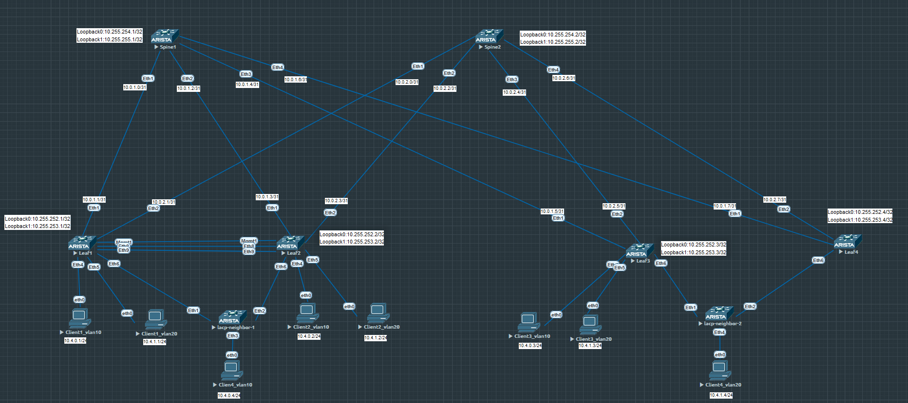

# Лабораторная работа по теме "Построение multihoming"

### Цель:
- Настроить multihoming MCLAG и EVPN multihoming;

### Топология


### Конфигурация

Топология и адресация представлена выше на схеме. Добавим Leaf4 с аналогичными настройками Leaf1-Leaf4. В данной схеме Leaf1 и Leaf2 будут настроены с помощью mclag. lacp-neighbor-1 будет клиентом для этих двух коммутаторов. Leaf3 и Leaf4 будут настроены как EVPN multihoming. lacp-neighbor-2 будет клиентом для этих двух коммутаторов. 
### Настройка mlag
Для настройки mlag между Leaf1 и Leaf2 первое что надо сделать это интерфейс через который будет синхронизация и изучение маков и SVI. Можно выбирать любой vlan, но рекомендация Arista это 4094 влан, так и сделаем. в vlan 4094 укажем команду trunk group mlag-trunk, это означает, что каждый раз когда мы будет на транках включать команду switchport mode trunk у нас влан 4094 будет исключаться  для предотвращения петли. Этот влан должен быть только между Leaf1 и Leaf2. ip адреса Leaf настраиваем из сети 10.1.0.0, 3 октет указывает между какими Leaf строится (в нашем примере 1 и 2, т.е. 3 октет 12). 4 октет будет 1 для первого соседа, 2 для второго соседа. 
Leaf1
```
vlan 4094
   name mlag
   trunk group mlag-trunk
!
interface Vlan4094
   no autostate
   ip address 10.1.12.1/30
```
Отключаем stp на влане 4094 чтобы он никогда не блокировался и делаем Leaf1 и Leaf2 stp root коммутаторами, чтобы не было при падении линков перестроения stp и будут теряться плюсы mlag
```
no spanning-tree vlan-id 4094
spanning-tree mst 0 priority 8192
```
Далее настраиваем интерфейс между Leaf1 и Leaf2. Для резервирования и чтобы не было bottleneck рекомендуется делать агрегирование линков. Создаем транк и командой switchport trunk group mlag-trunk добавляем туда наш vlan 4094
```
interface Port-Channel4094
   description mlag
   switchport mode trunk
   switchport trunk group mlag-trunk
!   
interface Ethernet8
   channel-group 4094 mode active
!
interface Ethernet9
   channel-group 4094 mode active
```
Настройка самого mlag. Указываем наш SVI 4094 и соседа с которым будем обмениваться информацией. Ну и указываем сам peer-link через который это будет происходить. 
```
mlag configuration
   domain-id mlag-domain
   local-interface Vlan4094
   peer-address 10.1.12.2
   peer-link Port-Channel4094
```
Описания не нашел, но насколько понял tcp для синхронизации, а udp для изучения мак-адресов, пересылки трафика и heartbeat. 

Далее настраиваем агрегирование на коммутатор lacp-neighbor-1, включаем LACP и ассоциируем Portchannel с mlag id 1.
```
interface Port-Channel1
   switchport mode trunk
   mlag 1
!
interface Ethernet6
   channel-group 1 mode active
```
Со стороны коммутатора lacp-neighbor-1 это обычная настройка агрегирования, коммутатор ничего "не знает" про mlag.
```
interface Port-Channel1
   switchport mode trunk
!
interface Ethernet1
   channel-group 1 mode active
!
interface Ethernet2
   channel-group 1 mode active
```
###Провека mlag
Проверяем на Leaf, что mlag поднялся и Port-channel работает
```ruby
Leaf1#sh mlag
MLAG Configuration:
domain-id                          :         mlag-domain
local-interface                    :            Vlan4094
peer-address                       :           10.1.12.2
peer-link                          :    Port-Channel4094
peer-config                        :          consistent

MLAG Status:
state                              :              Active
negotiation status                 :           Connected
peer-link status                   :                  Up
local-int status                   :                  Up
system-id                          :   52:00:00:03:37:66
dual-primary detection             :            Disabled
dual-primary interface errdisabled :               False

MLAG Ports:
Disabled                           :                   0
Configured                         :                   0
Inactive                           :                   0
Active-partial                     :                   0
Active-full                        :                   1
!
Leaf1#sh mlag interfaces detail
                                        local/remote
 mlag         state   local   remote    oper    config    last change   changes
------ ------------- ------- -------- ------- ---------- -------------- -------
    1   active-full     Po1      Po1   up/up   ena/ena    2:05:13 ago        10
!
Leaf1#
Leaf1#sh mlag interfaces members
Mlag1 is Port-Channel1
  Active Ports: Ethernet6 PeerEthernet6
```
Со стороны lacp-neighbor-1 оба порта в транке и активны
```
lacp-neighbor-1#sh port-channel active-ports brief
Port Channel Port-Channel1:
  Active Ports: Ethernet1 Ethernet2
```
Проверяем connectivity между Client4_vl10 (подключен к lacp-neighbor-1) и Client3_vl20 (подключен к Leaf3)
```
Client4_vl10> ping 10.4.1.3
84 bytes from 10.4.1.3 icmp_seq=1 ttl=63 time=302.309 ms
84 bytes from 10.4.1.3 icmp_seq=2 ttl=63 time=297.517 ms
84 bytes from 10.4.1.3 icmp_seq=3 ttl=63 time=294.466 ms
84 bytes from 10.4.1.3 icmp_seq=4 ttl=63 time=347.514 ms
84 bytes from 10.4.1.3 icmp_seq=5 ttl=63 time=321.830 ms
```
Поочередно отключим интерфейс Ethernet6 на Leaf2, а затем Leaf1 (shutdown)
```ruby
!оба линка работают, со стороны коммутатора lacp-neighbor-1 оба порта активные
lacp-neighbor-1#sh port-channel active-ports brief
Port Channel Port-Channel1:
  Active Ports: Ethernet1 Ethernet2
!
!Опускаем интерфейс на Leaf2, видно что Ethernet2 пропал из агрегированного канала
lacp-neighbor-1#sh port-channel active-ports brief
Port Channel Port-Channel1:
  Active Ports: Ethernet1
!
!Подняли оба интерфейса
lacp-neighbor-1#sh port-channel active-ports brief
Port Channel Port-Channel1:
  Active Ports: Ethernet1 Ethernet2
!
!Опустили интерефейс на Leaf1, видно что Ethernet2 пропал из агрегированного канала
lacp-neighbor-1#sh port-channel active-ports brief
Port Channel Port-Channel1:
  Active Ports: Ethernet2
```
Между между Client4_vl10 (подключен к lacp-neighbor-1) и Client3_vl20 (подключен к Leaf3) запущен постоянный ping. Тоже самое происходит если отключить один из Leaf.
```
Client4_vl10> ping 10.4.1.3 -c 200

10.4.1.3 icmp_seq=1 timeout
84 bytes from 10.4.1.3 icmp_seq=2 ttl=63 time=490.467 ms
84 bytes from 10.4.1.3 icmp_seq=3 ttl=63 time=386.395 ms
84 bytes from 10.4.1.3 icmp_seq=4 ttl=63 time=425.094 ms
84 bytes from 10.4.1.3 icmp_seq=5 ttl=63 time=410.323 ms
84 bytes from 10.4.1.3 icmp_seq=6 ttl=63 time=348.515 ms
84 bytes from 10.4.1.3 icmp_seq=7 ttl=63 time=318.691 ms
84 bytes from 10.4.1.3 icmp_seq=8 ttl=63 time=451.306 ms
84 bytes from 10.4.1.3 icmp_seq=9 ttl=63 time=331.981 ms
84 bytes from 10.4.1.3 icmp_seq=10 ttl=62 time=30.409 ms
84 bytes from 10.4.1.3 icmp_seq=11 ttl=62 time=25.408 ms
84 bytes from 10.4.1.3 icmp_seq=12 ttl=62 time=30.541 ms
84 bytes from 10.4.1.3 icmp_seq=13 ttl=62 time=39.027 ms
84 bytes from 10.4.1.3 icmp_seq=14 ttl=62 time=22.561 ms
84 bytes from 10.4.1.3 icmp_seq=15 ttl=62 time=269.243 ms
84 bytes from 10.4.1.3 icmp_seq=16 ttl=63 time=497.839 ms
84 bytes from 10.4.1.3 icmp_seq=17 ttl=62 time=67.659 ms
84 bytes from 10.4.1.3 icmp_seq=18 ttl=62 time=27.655 ms
84 bytes from 10.4.1.3 icmp_seq=19 ttl=62 time=32.388 ms
84 bytes from 10.4.1.3 icmp_seq=20 ttl=62 time=36.221 ms
84 bytes from 10.4.1.3 icmp_seq=21 ttl=62 time=28.239 ms
84 bytes from 10.4.1.3 icmp_seq=22 ttl=62 time=27.997 ms
84 bytes from 10.4.1.3 icmp_seq=23 ttl=62 time=39.350 ms
84 bytes from 10.4.1.3 icmp_seq=24 ttl=62 time=38.743 ms
84 bytes from 10.4.1.3 icmp_seq=25 ttl=62 time=30.136 ms
84 bytes from 10.4.1.3 icmp_seq=26 ttl=62 time=52.483 ms
84 bytes from 10.4.1.3 icmp_seq=27 ttl=62 time=30.293 ms
84 bytes from 10.4.1.3 icmp_seq=28 ttl=62 time=31.247 ms
84 bytes from 10.4.1.3 icmp_seq=29 ttl=62 time=34.097 ms
84 bytes from 10.4.1.3 icmp_seq=30 ttl=62 time=30.583 ms
84 bytes from 10.4.1.3 icmp_seq=31 ttl=62 time=28.314 ms
84 bytes from 10.4.1.3 icmp_seq=32 ttl=62 time=29.204 ms
84 bytes from 10.4.1.3 icmp_seq=33 ttl=62 time=81.321 ms
84 bytes from 10.4.1.3 icmp_seq=34 ttl=62 time=51.360 ms
84 bytes from 10.4.1.3 icmp_seq=35 ttl=62 time=29.838 ms
84 bytes from 10.4.1.3 icmp_seq=36 ttl=62 time=34.302 ms
84 bytes from 10.4.1.3 icmp_seq=37 ttl=62 time=76.772 ms
84 bytes from 10.4.1.3 icmp_seq=38 ttl=62 time=30.527 ms
84 bytes from 10.4.1.3 icmp_seq=39 ttl=62 time=41.214 ms
84 bytes from 10.4.1.3 icmp_seq=40 ttl=62 time=180.142 ms
10.4.1.3 icmp_seq=41 timeout
84 bytes from 10.4.1.3 icmp_seq=42 ttl=62 time=37.867 ms
84 bytes from 10.4.1.3 icmp_seq=43 ttl=62 time=24.507 ms
84 bytes from 10.4.1.3 icmp_seq=44 ttl=62 time=40.480 ms
84 bytes from 10.4.1.3 icmp_seq=45 ttl=62 time=32.993 ms
84 bytes from 10.4.1.3 icmp_seq=46 ttl=62 time=31.790 ms
84 bytes from 10.4.1.3 icmp_seq=47 ttl=62 time=25.891 ms
84 bytes from 10.4.1.3 icmp_seq=48 ttl=62 time=24.044 ms
^C
```
Для предотавращения падения peer-link и чтобы оба коммутатора не стали primary (защита от split brain) необходимо настроить отдельным линком management между коммутаторами heartbeat (к сожалению не смог этого сделать в underlay сети до лупбеков, т.к. нельзя в heartbeat настройки указывать source адрес). Мне просто показалось более избыточность линков будет между лупбеками через underlay для heartbeat в сравнении с management. 
```
interface Management1
   vrf management
   ip address 10.2.12.1/30
!
mlag configuration
   peer-address heartbeat 10.255.252.2
   dual-primary detection delay 10 action errdisable all-interfaces

```
В итоге при падении  peer-link мы это обнаружим через heartbeat и secondary переведет все свои интерфейсы в состояние errdisable (агрегированные, orphen портов это не касается). К сожалению этого всего в лабе я проверить не смог. как минимум не могу recovery errdisable настроить 
```
Leaf1#sh errdisable recovery
   Errdisable Reason              Timer Status   Timer Interval
------------------------------ ----------------- --------------
   acl                            Disabled                  300
   arp-inspection                 Disabled                  300
   bgp-session-tracking           Disabled                  N/A
   bpduguard                      Disabled                  300
   dot1x                          Disabled                  300
   dot1x-session-replace          Disabled                  300
   evpn-sa-mh                     Disabled                  N/A
   fabric-link-failure            Disabled                  N/A
   fabric-link-flap               Disabled                  N/A
   hitless-reload-down            Disabled                  300
   lacp-no-portid                 Disabled                  N/A
   lacp-rate-limit                Disabled                  300
   license-enforce                Disabled                  N/A
   link-flap                      Disabled                  300
   mlagasu                        Disabled                  N/A
   mlagdualprimary                Disabled                  N/A
   mlagissu                       Disabled                  N/A
   mlagmaintdown                  Disabled                  N/A
   no-internal-vlan               Disabled                  300
   portchannelguard               Disabled                  300
   portsec                        Disabled                  300
   stp-no-portid                  Disabled                  N/A
   tapagg                         Disabled                  300
   uplink-failure-detection       Disabled                  300

Leaf1(config)#errdisable recovery cause ?
  acl                       Enable the acl cause
  arp-inspection            Enable the arp-inspection cause
  bpduguard                 Enable the bpduguard cause
  dot1x                     Enable the dot1x cause
  dot1x-session-replace     Enable the dot1x-session-replace cause
  hitless-reload-down       Enable the hitless-reload-down cause
  lacp-rate-limit           Enable the lacp-rate-limit cause
  link-flap                 Enable the link-flap cause
  no-internal-vlan          Enable the no-internal-vlan cause
  portchannelguard          Enable the portchannelguard cause
  portsec                   Enable the portsec cause
  tapagg                    Enable the tapagg cause
  uplink-failure-detection  Enable the uplink-failure-detection cause
```
Также мне никак не опустить peerlink. Даже когда на горячуюю удаляю линки между Leaf1 и Leaf2 то трафик ходит на интерфейсек (через wireshark проверял) до тех пор пока не выключишь и включишь, но тогда уже mlag не соберется после включения. 
```
Leaf1(config)#int port-c 4094
! Interface Port-Channel4094 is configured as the MLAG peer link
Leaf1(config-if-Po4094)#no    switchport trunk group mlag-trunk
% Interface Port-Channel4094 is configured as the MLAG peer link, Mlag Trunk Group mlag-trunk is not deleted
!
Leaf1(config-if-Po4094)#shut
% Interface Port-Channel4094 is configured as the MLAG peer link; no interface was shutdown
!
Leaf1(config)#int e 8
! Interface Ethernet8 is a member of the MLAG peer link Port-Channel4094
Leaf1(config-if-Et8)#shut
% Interface Ethernet8 is a member of the MLAG peer link Port-Channel4094; no interface was shutdown
!
Leaf1(config)#int vl 4094
! Vlan4094 is configured as the MLAG local interface
Leaf1(config-if-Vl4094)#shut
% Vlan4094 is configured as the MLAG local interface; no interface was shutdown
```

### Настройка EVPN multihoming
Настроим EVPN multihoming. В отличие от mclag тут не нужны линки между Leaf (peerlink) и можно подключать агрегирование больше чем к двум лифам (в лабе 2, но выключив все и на 3х линках тестировал, мощности в лабе не хватает). Строим между Leaf3 и Leaf4. Конфиг для Leaf3 приведен ниже
Leaf3
```
interface Port-Channel1
   switchport trunk allowed vlan 10,20
   switchport mode trunk
   !
   evpn ethernet-segment
      identifier 0000:0000:0003:0004:0001
      route-target import 00:03:00:04:00:01
   lacp system-id 0003.0004.0001
!   
interface Ethernet6
   channel-group 1 mode active
```
Создаем Port-channel, указываем что агрегирование evpn multihoming. identifier уникально идентифицирует принадлежность к ethernet segment. Формат 0000:0000:\<Leaf3\>:\<Leaf4\>:\<port-channel number\>. Leaf3 - 0003, Leaf4 - 0004, port-channel 1 - 0001. Итого выходит идентификатор 0000:0000:0003:0004:0001  
route-target import нужа для того, чтобы только ESI коммутаторы импортировали маршруты. Формат \<Leaf3\>:\<Leaf4\>:\<port-channel number\>. Итого выходит 00:03:00:04:00:01. 
lacp system-id должен быть одинаковый, чтобы downstream коммутатор смог lacp агрегированный канал собрать, иначе он будет считать что подключен в разные коммутаторы и не соберет. Так сказать обманываем downstrem коммутатор. Генерируем также \<leaf3\>.\<leaf4\>.\<port-channel number\>. Итого выходит 0003.0004.0001  

route-type 1 в EVPN нужны для сигнализирования о Port-channel`ах. В данном примере видно что 2 multihoming 10.255.253.3:1 (Leaf3) и 10.255.253.4:1 (Leaf4). Они оба принадлежат к одному ethernet сегменту т.к. одинаковый id 0000:0000:0003:0004:0001, т.е. подключены к одному downstream коммутатору. 65003:100010, 65004:100010, 65003:100020, 65004:100020 это соответственно вланы в транках 10 и 20 с Leaf3 и Leaf4 (switchport trunk allowed vlan 10,20). Если удалить или добавить влан к транку, то записи будут изменятся в evpn таблице. 
```
Leaf3#sh bgp evpn route-type auto-discovery
BGP routing table information for VRF default
Router identifier 10.255.252.3, local AS number 65003
Route status codes: * - valid, > - active, S - Stale, E - ECMP head, e - ECMP
                    c - Contributing to ECMP, % - Pending BGP convergence
Origin codes: i - IGP, e - EGP, ? - incomplete
AS Path Attributes: Or-ID - Originator ID, C-LST - Cluster List, LL Nexthop - Link Local Nexthop

          Network                Next Hop              Metric  LocPref Weight  Path
 * >      RD: 65003:100010 auto-discovery 0 0000:0000:0003:0004:0001
                                 -                     -       -       0       i
 * >      RD: 65003:100020 auto-discovery 0 0000:0000:0003:0004:0001
                                 -                     -       -       0       i
 * >      RD: 65004:100010 auto-discovery 0 0000:0000:0003:0004:0001
                                 10.255.253.4          -       100     0       65000 65004 i
 * >      RD: 65004:100020 auto-discovery 0 0000:0000:0003:0004:0001
                                 10.255.253.4          -       100     0       65000 65004 i
 * >      RD: 10.255.253.3:1 auto-discovery 0000:0000:0003:0004:0001
                                 -                     -       -       0       i
 * >      RD: 10.255.253.4:1 auto-discovery 0000:0000:0003:0004:0001
                                 10.255.253.4          -       100     0       65000 65004 i

```
Настроим коммутатор lacp-neighbor-2 как обычный коммутатора lacp
```
interface Port-Channel1
   switchport trunk allowed vlan 10,20
   switchport mode trunk
!
interface Ethernet1
   channel-group 1 mode active
!
interface Ethernet2
   channel-group 1 mode active
```
Проверяем, что коммутатор lacp-neighbor-2 поднял port-channel и добавил туда два линка 
```
lacp-neighbor-2#sh port-channel active-ports brief
Port Channel Port-Channel1:
  Active Ports: Ethernet1 Ethernet2
```
Запускаем пинг с компьютера 10.4.1.4 (00:50:79:66:68:0e) подключенного за коммутатором lacp-neighbor-2 до 10.4.1.1 (00:50:79:66:68:10) подключенного к Leaf1. 


```ruby
Leaf1#sh bgp evpn route-type mac-ip 0050.7966.680e vni 100020 detail
BGP routing table information for VRF default
Router identifier 10.255.252.1, local AS number 65001
BGP routing table entry for mac-ip 0050.7966.680e, Route Distinguisher: 65003:100020
 Paths: 1 available
  65000 65003
    10.255.253.3 from 10.255.254.1 (10.255.254.1)
      Origin IGP, metric -, localpref 100, weight 0, tag 0, valid, external, best
      Extended Community: Route-Target-AS:1:100020 TunnelEncap:tunnelTypeVxlan
      VNI: 100020 ESI: 0000:0000:0003:0004:0001
BGP routing table entry for mac-ip 0050.7966.680e 10.4.1.4, Route Distinguisher: 65003:100020
 Paths: 1 available
  65000 65003
    10.255.253.3 from 10.255.254.1 (10.255.254.1)
      Origin IGP, metric -, localpref 100, weight 0, tag 0, valid, external, best
      Extended Community: Route-Target-AS:1:100020 Route-Target-AS:1:100666 TunnelEncap:tunnelTypeVxlan EvpnRouterMac:50:00:00:15:f4:e8
      VNI: 100020 L3 VNI: 100666 ESI: 0000:0000:0003:0004:0001
BGP routing table entry for mac-ip 0050.7966.680e 10.4.1.4, Route Distinguisher: 65004:100020
 Paths: 1 available
  65000 65004
    10.255.253.4 from 10.255.254.1 (10.255.254.1)
      Origin IGP, metric -, localpref 100, weight 0, tag 0, valid, external, best
      Extended Community: Route-Target-AS:1:100020 Route-Target-AS:1:100666 TunnelEncap:tunnelTypeVxlan EvpnRouterMac:50:00:00:af:d3:f6 EvpnNdFlags:pflag
      VNI: 100020 L3 VNI: 100666 ESI: 0000:0000:0003:0004:0001

```
