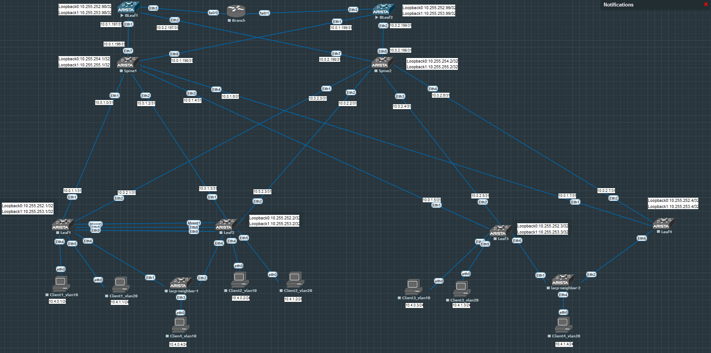

# Лабораторная работа по теме "Оптимизация таблиц маршрутизации"

### Цель:
- Реализовать обмен между клиентами в разных vrf через route-type 5;

### Топология


### Конфигурация

Топология и адресация представлена выше на схеме. Добавим Border Leaf1 и Border Leaf2 в нашу топологию, их настроим аналогично обычным Leaf за исключением, что нет клиентов и не надо interface Vlan делать. Сеть 10.4.0.0/24 будет в vrf Customer1, сеть 10.4.1.0/24 в vrf Customer2. Для этого добавляем в нашу фабрику новый vrf и раскидываем по Leaf его. На бордерах не создаем interface Vlan
```
vrf instance Customer2
ip routing vrf Customer2
!
interface Vlan20
   vrf Customer2
   ip address virtual 10.4.1.254/24
! 
int vxl1   
vxlan vrf Customer2 vni 100667   
!
router bgp 650xx
 vrf Customer2
      rd 10.255.252.xx:2
      route-target import evpn 1:100667
      route-target export evpn 1:100667
      redistribute connected
```
